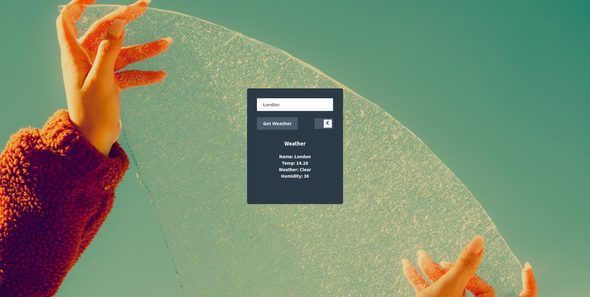

# Weather App

<h1 align="center">
  
</h1>

<h1 align="center">The Weather App</h1>
      
<p align="center">
  <a href="#about">About</a> •
  <a href="#getting-started">Getting Started</a> •
  <a href="#contributing">Contributing</a> •
  <a href="#api-setup">API Setup</a> •
  <a href="#authors">Authors</a>
</p>

---

## About
This Weather App is a simple web application that uses OpenWeatherMap API  to fetch weather data for a specific location. It uses the data to change the background image relevant to the weather and displays other information.


## Live Demo
[Live Demo](https://smcommits.github.io/weather_app/)

## Getting Started

* Clone this repo
    ```
    git clone https://github.com/smcommits/weather_app.git
    ```
* Navigate to project folder
    ```
    cd weather_app
    ```
* Install all the dependencies using the following command
    ```
    npm install
    ```
* Navigate to the dist folder 
   ```
   cd dist
   ```
* To interact with the website, open index.html in your web browser.

## API Setup

The application uses two different APIs. The [OpenWeatherMap](https://openweathermap.org/) API to fetch the weather data and Pexels API to fetch images relevant to weather condition

### Open Weather Map API Setup
To setup OpenWeatherMap API, please visit [OpenWeatherMap's website.](https://openweathermap.org/). The API key is all you need to call any of our weather APIs.
Once you sign up using your email, the API key (APPID) will be sent to you in a confirmation email. 
Your API keys can always be found on your account page, where you can also generate additional API keys if needed.

After successfully acquiring the API, you can use [this documentation](https://openweathermap.org/current) to learn more about different endpoints and how to use an API key to fetch data. 

Example Use:

```
api.openweathermap.org/data/2.5/weather?q={city name}&appid={API key}
```

### Pexels API Setup
To setup Pexels API, please visit [Pexel's API Wesbite](https://www.pexels.com/api/). You need an API key to communicate with different endpoints. To acquire an API key, please create an account and login. 
After acquiring the API key, please use [this documentation](https://www.pexels.com/api/documentation/) to learn more about different endpoints and the kind of data you can fetch from Pexels

Example Use:
```
curl -H "Authorization: {your API key}" \
  "https://api.pexels.com/v1/search?query=nature&per_page=1"
```

## Technologies Used
- Javascript (vanilla)
- Webpack for bundling the code
- NPM for dependencies and script handling
- ESLINT for lining Javascript
- Sylelint for lining CSS


## Authors

👤 **Anas Siddiqui**
  - GitHub: [@githubhandle](https://github.com/smcommits)
  - LinkedIn: [linkedIn](https://linkedin.com/in/sm-anas)


## Contributing

Contributions, issues, and feature requests are welcome!

Feel free to check the [issues page](https://github.com/smcommits/private-events/issues).


## Acknowledgements

Credits go to The Odin Project for providing essential guidance and an opportunity to build this amazing project
  - [**The Odin Project**](https://www.theodinproject.com/home)

## Show your support

Give a ⭐️ if you like this project!

